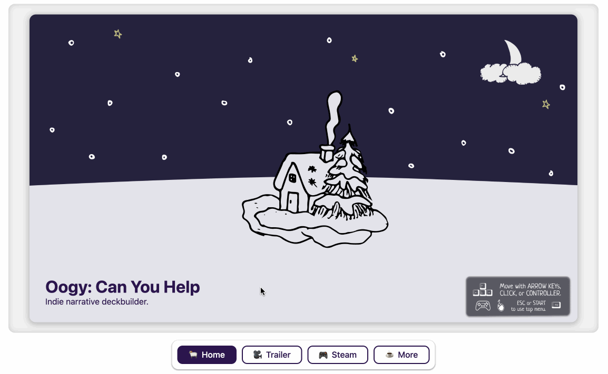

# cone

🍦 vanilla js static pwa generator, built in ts for [Oogy: Can You Help](https://oogycanyouhelp.com) (~11kB)

[✨ Go to live example on Github Pages](https://insanj.github.io/cone/example.html)

<p align="center">

</p>

Does not require any dependencies. Treats Browser and Node.js equally. Uses Typescript interally to generate `Cone.js` for either [npm](https://www.npmjs.com/) or inline usage.

Wraps all Browser (DOM) methods and classes so 🍦 cone generates to a string consistently in every environment. No need for `window`, `document`, `Element`, or `jquery`.

Why? For fun! I thought a completely in-house static website generator would be a good thing to maintain using current ECMAScript standards for my current projects, as well as a demo of some of the techniques from [Oogy: Can You Help](https://oogycanyouhelp.com) itself.

## Install

In Browser, download `dist/` and place the `Cone.min.js` (or `Cone.js`) somewhere in your website.

```html
<script src="Cone.min.js"></script>
```

In NodeJS, as simple as:

```bash
npm install oogy-cone
```

Then in any environment:

```ts
import { Cone } from "Cone.js";
// or 'oogy-cone', 'Cone.min.js', 'Cone' depending on your context

const template = {
  // 🍦 .cone template, either in utf-8 string or JSON
};

// -> or alternatively, in NodeJS contexts:
// import fs from 'fs';
// const data = fs.readFileSync('example.cone', 'utf8');
// -> just as in browser, you could import a data file from somewhere using <script>

const website = Cone.ConeBuilder.build({
  template,
});
```

> NOTE: see [tsconfig.json](https://github.com/insanj/cone/blob/main/tsconfig.json) to configure anything about the build process.

## Usage

In Browser:

```html
<script type="module">
  import { Cone } from "./Cone.min.js";
  const website = Cone.ConeBuilder.build({
    template: {
      // 🍦 .cone template goes here
    },
  });

  document.body.innerHTML += website;
</script>
```

[See example.html for a tiny example of using 🍦 cone with a single .html file, and no external files besides the Cone.min.js release](https://github.com/insanj/cone/blob/main/example.html/)

Use the following command to experiment with Browser usage locally:

```bash
npm run example-html
```

In Express:

```ts
const app = express();
app.use("/", (req, res) => {
  const template = fs.readFileSync("example.cone", "utf8");
  const website = Cone.ConeBuilder.build({
    template,
  });
  res.set("Content-Type", "text/html");
  res.send(website);
});
```

[See example/ for a tiny example of using 🍦 cone with Express to serve a website using an `example.cone` file](https://github.com/insanj/cone/blob/main/example/)

Use the following command to experiment with Node usage locally:

```ts
npm run example
```

## .cone

### example

```js
{
  /**
   * optional:
   * style attributes, defaults to "#fff" & "#2b154d"
   */
  "style": {
    "background": "black", /* can be any CSS supported val */
    "color": "#fff"
  },

  /** content tabs */
  "tabs": [
    {
      /** title of this tab */
      "title": "🍦 Home",

      /** content/"body" of this tab */
      "content": {
        /** style, which will help the elements look nice */
        "style": "jumbotron",

        /**
         * optional: alignment of alignable items within the
         * elements list (excludes large media, ex: img, video)
         * defaults to "bottom-left"
        */
        "align": "bottom-left",

        /** list of elements we want to show in this tab */
        "elements": [
          {
            /** this is an image type */
            "type": "img",

            /** here is the image src attribute, which can be any URL that works from where the site is hosted */
            "src": "/png/jumbotron.png"
          },
          {
            /** h1 header type, all normal HTML types are used, and inline styles so its easy to customize after generating as well */
            "type": "h1",

            /** we'll want to fill in the text for the title elements instead of the `src` attribute */
            "text": "Oogy: Can You Help"
          },
          {
            /** finally, a p element which works as a subtitle in this case on the jumbotron style */
            "type": "p",
            "text": "Indie narrative deckbuilder."
          }
        ]
      }
    },
    {
      "title": "🎥  Trailer",

      "content": {
        "style": "jumbotron",
        "elements": [
          {
            "type": "iframe",
            "src": "https://www.youtube.com/embed/p8D-DACFWbk"
          }
        ]
      }
    },
    {
      "title": "🎮  Steam",
      "content": {
        "style": "jumbotron",
        "elements": [
          {
            "type": "iframe",
            "src": "https://store.steampowered.com/widget/1880310/"
          },
          {
            "type": "h1",
            "text": "The Studio Update - v1.4.0"
          },
          {
            "type": "p",
            "text": "Make your own custom cards, decks, and games in the most ambitious content update yet, now available on Steam for PC and Mac.\n\nUsing The Studio, anyone can create entirely unique cards and throw them into Custom Games. Custom Games have no restrictions, and allow you to turn your save into a playground for whatever type of fun is your favorite. Copy any normal game or make a new one from scratch to see how things would pan out if you chose differently. Edit, delete, and move cards in your Custom Deck anytime."
          }
        ]
      }
    },
    {
      "title": "☕️  More",
      "content": {
        "style": "list",
        "align": "center-center",
        "elements": [
          {
            "type": "a",
            "text": "🦚   Twitter",
            "href": "https://twitter.com/OogyCanYouHelp"
          },
          {
            "type": "a",
            "text": "🎨   Instagram",
            "href": "https://instagram.com/OogyCanYouHelp"
          },
          {
            "type": "a",
            "text": "👾   Github",
            "href": "https://github.com/insanj"
          },
          {
            "type": "a",
            "text": "📰   Press Kit",
            "href": "https://drive.google.com/file/d/10YZxuofJn8aazM0_0sO1G-fEsCgP-BfQ/view?usp=sharing"
          }
        ]
      }
    }
  ]
}
```

## Author

```
Julian @insanj Weiss
github.com/insanj
(c) 2022
```

## License

```
MIT License

Copyright (c) 2022 Julian Weiss

Permission is hereby granted, free of charge, to any person obtaining a copy
of this software and associated documentation files (the "Software"), to deal
in the Software without restriction, including without limitation the rights
to use, copy, modify, merge, publish, distribute, sublicense, and/or sell
copies of the Software, and to permit persons to whom the Software is
furnished to do so, subject to the following conditions:

The above copyright notice and this permission notice shall be included in all
copies or substantial portions of the Software.

THE SOFTWARE IS PROVIDED "AS IS", WITHOUT WARRANTY OF ANY KIND, EXPRESS OR
IMPLIED, INCLUDING BUT NOT LIMITED TO THE WARRANTIES OF MERCHANTABILITY,
FITNESS FOR A PARTICULAR PURPOSE AND NONINFRINGEMENT. IN NO EVENT SHALL THE
AUTHORS OR COPYRIGHT HOLDERS BE LIABLE FOR ANY CLAIM, DAMAGES OR OTHER
LIABILITY, WHETHER IN AN ACTION OF CONTRACT, TORT OR OTHERWISE, ARISING FROM,
OUT OF OR IN CONNECTION WITH THE SOFTWARE OR THE USE OR OTHER DEALINGS IN THE
SOFTWARE.
```
